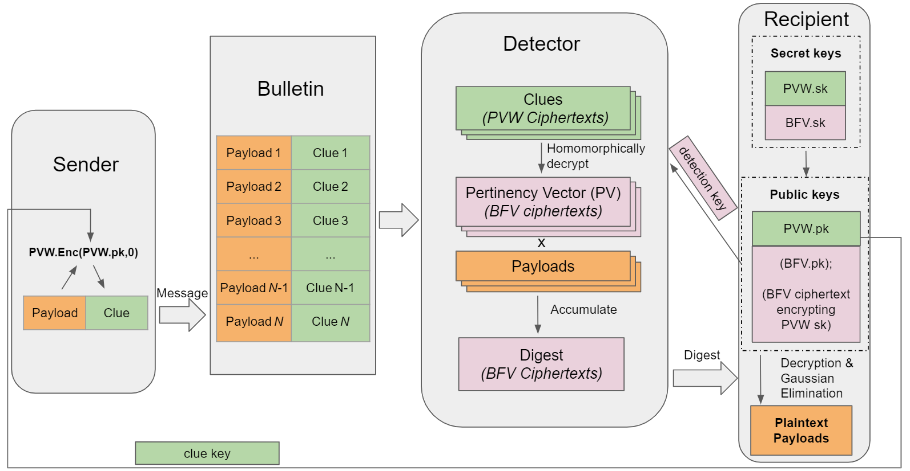

# Oblivious Message Retrieval: proof of concept C++ implementation for OMR

## Authors and paper

The OMR library is developed by [Zeyu (Thomas) Liu](https://zeyuthomasliu.github.io/) and [Eran Tromer](https://www.tau.ac.il/~tromer/) based on their paper [Oblivious Message Retrieval](https://eprint.iacr.org/2021/1256.pdf).

### Abstract:
Anonymous message delivery systems, such as private messaging services and privacypreserving payment systems, need a mechanism for recipients to retrieve the messages
addressed to them, without leaking metadata or letting their messages be linked. Recipients could download all posted messages and scan for those addressed to them, but
communication and computation costs are excessive at scale.
We show how untrusted servers can detect messages on behalf of recipients, and summarize these into a compact encrypted digest that recipients can easily decrypt. These servers
operate obliviously and do not learn anything about which messages are addressed to which
recipients. Privacy, soundness, and completeness hold even if everyone but the recipient is
adversarial and colluding (unlike in prior schemes), and are post-quantum secure.
Our starting point is an asymptotically-efficient approach, using Fully Homomorphic
Encryption and homomorphically-encoded Sparse Random Linear Codes. We then address
the concrete performance using a bespoke tailoring of lattice-based cryptographic components, alongside various algebraic and algorithmic optimizations. This reduces the digest
size to a few bits per message scanned. Concretely, the servers’ cost is a couple of USD per
million messages scanned, and the resulting digests can be decoded by recipients in under
20ms. Our schemes can thus practically attain the strongest form of receiver privacy for
current applications such as privacy-preserving cryptocurrencies.

## License
The OMR library is developed by [Zeyu (Thomas) Liu](https://zeyuthomasliu.github.io/) and [Eran Tromer](https://www.tau.ac.il/~tromer/) and is released under the MIT License (see the LICENSE file).

## Overview

We describe the problem which this library is dealing with. Please refer to our paper for more details.



### Problem Overview (Section 4.1 in our [paper](https://eprint.iacr.org/2021/1256.pdf))
In our system, we have a bulletin board (or board), denoted *BB*, that is publicly available contatining *N* messages. Each message is sent from some sender and is addressed to some recipient, whose identities are supposed to remain private. 

A message consists of a pair (*xi*, *ci*) where *xi* is the message payload to convey, and *ci* is a clue string which helps notify the intended recipient (and only them) that the message is addressed to them.

At any time, any potential recipient *p* may want to retrieve the messages in *BB* that are addressed to them. We call these messages pertinent (to *p*), and the rest are impertinent.

A server, called a detector, helps the recipient *p* detect which message indices in *BB* are pertinent to them, or retrieve the payloads of the pertinent messages. This is done obliviously: even a malicious detector learns nothing about which messages are pertinent. The recipient gives the detector their detection key and a bound *ḱ* on the number of pertinent messages they expect to receive. The detector then accumulates all of the pertinent messages in *BB* into string *M*, called the digest, and sends it to the recipient *p*.

The recipient *p* processes *M* to recover all of the pertinent messages with high probability, assuming a semi-honest detector and that the number of pertinent messages did not exceed *ḱ*.

## What's in the demo

### Oblivious Message Detection
- Obliviously identify the pertinent messages and pack all their indices into a into a single digest.
- Schemes benchmarked: OMD1p (section 7.2)
- Measured
    - Key size: ~99MB
    - Detector running time: ~0.03 sec/msg
    - Recipient running time: 5ms
    - Digest size: ~560KB

### Oblivious Message Retrieval
- Obliviously identify the pertinent messages and pack all their contents into a into a single digest.
- Schemes benchmarked: OMR1p (section 7.4) and OMR2p (section 7.5)
- Measured: 
    - Key sizes: ~129MB
    - detector running time (1-core): ~0.215 sec/msg and ~0.246 sec/msg
    - detector running time (2-core): ~0.108 sec/msg and ~0.123 sec/msg
    - detector running time (4-core): ~0.099 sec/msg and ~0.115 sec/msg
    - recipient running time: ~0.02 sec and ~0.063 sec


### Parameters 
N = 2^19 (or *N* = 500,000 padded to 2^19), k = *ḱ* = 50. Benchmark results on a Google ComputeCloudc2-standard-4instance type (4 hyperthreads of an Intel Xeon 3.10 GHz CPU with 16GB RAM) are reported in Section 10 in our [paper](https://eprint.iacr.org/2021/1256.pdf).

## Dependencies

The OMR library relies on the following:

- C++ build environment
- CMake build infrastructure
- [SEAL](https://github.com/microsoft/SEAL) library 3.6 or 3.7 and all its dependencies
- [PALISADE](https://gitlab.com/palisade/palisade-release) library release v1.11.2 and all its dependencies (as v1.11.2 is not publicly available anymore when this repository is made public, we use v1.11.3 in the instructions instead)
- [NTL](https://libntl.org/) library 11.4.3 and all its dependencies

### Scripts to install the dependencies and build the binary
```
LIBDIR=~/ObliviousMessageRetrieval   # change to you want the dependency libraries installed

sudo apt-get install autoconf # if no autoconf
sudo apt-get install cmake # if no cmake
sudo apt-get install libgmp3-dev # if no gmp
sudo apt-get install libntl-dev=11.4.3-1build1 # if no ntl

git clone -b v1.11.3 https://gitlab.com/palisade/palisade-release
cd palisade-release
mkdir build
cd build
cmake .. -DCMAKE_INSTALL_PREFIX=$LIBDIR
make -j
make install

git clone -b 3.6.6 https://github.com/microsoft/SEAL
cd SEAL
cmake -S . -B build -DCMAKE_INSTALL_PREFIX=$LIBDIR
cmake --build build
cmake --install build

git clone https://github.com/ZeyuThomasLiu/ObliviousMessageRetrieval 
cd ObliviousMessageRetrieval 
mkdir build
cd build
mkdir ../data
mkdir ../data/payloads
mkdir ../data/clues
cmake .. -DCMAKE_PREFIX_PATH=$LIBDIR
make
```

### To Run

```
cd ~/ObliviousMessageRetrieval/build
./OMRdemos
```

## Summary of Constructions
This is a high-level summary of our [paper](https://eprint.iacr.org/2021/1256.pdf).

### Generic Fully Homomorphic Encryption (FHE) (Section 5.3)
Generic-FHE has a special functionality we call "recrypt" (which is essentially the "bootstrapping" operation used in other literatures) that homomorphically decrypts an FHE ciphertext into another FHE ciphertext encrypted under the secret key corresponding to the recryption key (or bootstrapping key, and is public). 
We assume that suppose the plaintext space is *Z_p*, if an FHE ciphertext is encrypting 1 under sk1, and we recrypt that ciphertext using pk2 corresponding another secret key sk2, then the probability that the recrypted ciphertext encrypts 1 under sk2 has probability <= 1/*p* + negl. This is satisfied by FHE schemes like [FHEW](https://eprint.iacr.org/2014/816) or [TFHE](https://eprint.iacr.org/2018/421).

### Naive Process (Section 6.1.1)
Each sender encrypts ℓ FHE ciphertexts each encrypting 1 using the public key of the recipient, and therefore the recrypted ciphertexts will still be 1 with probability 1-negl for pertinent messages, and will only have probability 1/*p* to be 1 for impertinent messages. 
We then compute the AND gate over all ℓ recrypted ciphertexts resulting into 1 ciphertext, which is 1 for pertinent messages, and 0 with probability (1-(1/*p*)^ℓ) for impertinent messages. We call the resulted ciphertexts a vector of pertinency indicators (PV).

### Randomized PV compression (Section 6.1.2)
Assuming there are at most *ḱ* pertinent messages, we first prepare m buckets (each of which is just a vector FHE ciphertext ciphertexts used to represent numbers in *Z_N*), where *m* >> *ḱ*. Then, we randomly distribute (PV_*i*×*i*), *i* \in \[*N*\] into those m buckets. If there is no collision, the recipient can just decrypt the buckets and obtain all the pertinent indices. To detect the collision, we keep a counter for each bucket. 

### Reducing Failure Rate (Section 6.1.2)
If there is a collision, the process fails. Let's say the collision rate is *p*. We can repeat the above process *C* trails, and this gives us a failure probability of *p^C*. To further reduce the failure rate, we can gather partial information from each trail and gather the information together.

### Payload Retrieval (Section 6.2)
So far we have only collected indices. To collect all the payloads, we can just compute (PV_*i*×payload_*i*) and send all i \in \[N\]. To make it compact, we use Ramdom Linear Coding (RLC), which is letting the detector assign a random weight *w_i* to (PV_*i*×payload_*i*), compute (*w_i*×PV_*i*×payload_*i*), and then sum the result together. We repeat this process *ḱ'* times for some *ḱ' >= ḱ*, so we get *ḱ'* equations. As long as at least *ḱ* of them are linearly independent, the recipient can decrypt the result assuming the detector sends back the weights (using a random seed).

### Improved Payload Retrieval (Section 6.3)
To reduce the computational cost of the server, instead of using RLC, we use sparse RLC. This means that only a small portion of the random weights are non-zero. The detailed arguments and analysis are relatively involved, so we omit the details here. Please see section 6.3 in our paper for details.

### Using PVW ciphertext as clue (Section 7.1)
Instead of using FHE ciphertext, we choose to use PVW ciphertext as clue to increase pracality, as [PVW](https://eprint.iacr.org/2007/348.pdf) ciphertext has size (*n* + ℓ) where *n* is the secret key dimension and it can be homomorphically decrypted relatively easily. The decryption circuit is designed based on this [paper](https://eprint.iacr.org/2021/1335.pdf).

### Using BFV homomorphic encryption (Section 7.2)
Since we do not need the recrypt operation, we can use leveled homomoprhic encryption instead of FHE to further reduce the computation cost. [B](https://eprint.iacr.org/2012/078)/[FV](https://eprint.iacr.org/2012/144) scheme is our choice, as it supports modular arithmetic on encrypted integers and SIMD-like operations. The PVW secret key is encrypted under BFV as well.

### Deterministic Digest Compression (Section 7.2)
Instead of using the randomized compression process as described above, we can compress the digest deterministically. Since each BFV ciphertext has *D* slots, where *D* is the ring dimentsion, and each slots performs operations on *Z_p*, we have *D×log(p)* bits in each ciphertext. Such compression gives us <5 bit/msg digest for index retrieval (compared to 926 bit/msg for the current solution used by Zcash). Of course, randomized digest compression is still better asymptotically, so for some parameters (e.g., *N* = 10,000,000, *ḱ* = 50), randomized digest compression is still prefered. The detailed comparisons are shown in Section 10 in our paper.

### Reducing Detection Key Size (Section 7.8)
The encryption of PVW secret key can be packed into a single BFV ciphertext (to achieve this, we redesigned the decryption circuit), which then reduces the detection key size from 13.5GB to ~2.6GB. We can use the seed mode in SEAL to further reduce it to ~1.3GB. This is still large and mainly due to the rotation keys of BFV. We can further reduce this cost by generating level-specific rotation keys. After the full compression, we now have detection key size of <130 MB for OMR1p and OMR2p, and of <100MB for OMD1p. Note that detection key is a one-time communication cost that doesn't need to be sent privately.

### Additional properties
DoS resistance (Section 8) and key-unlinkablity (Section 9) are both supported, where DoS resistance is supported inherantly and key-unlinkability requires application-specific changes.